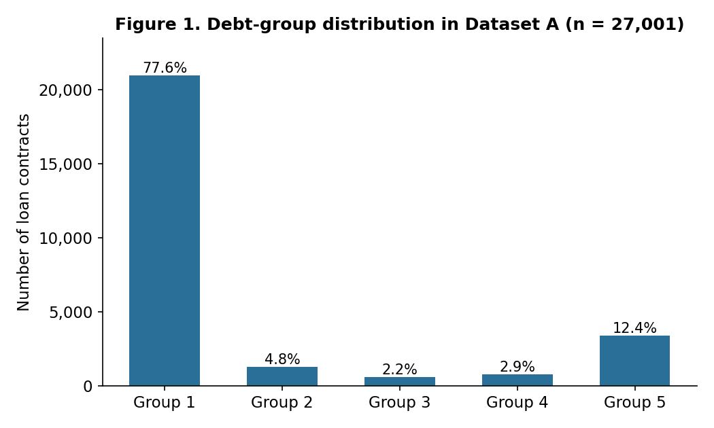
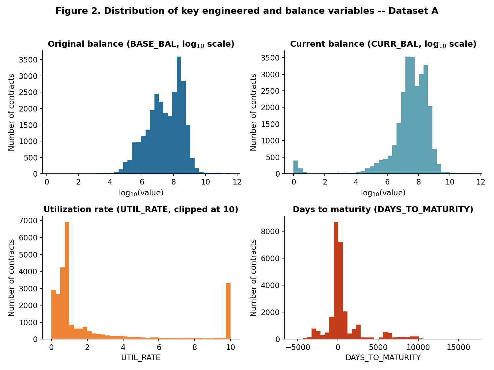
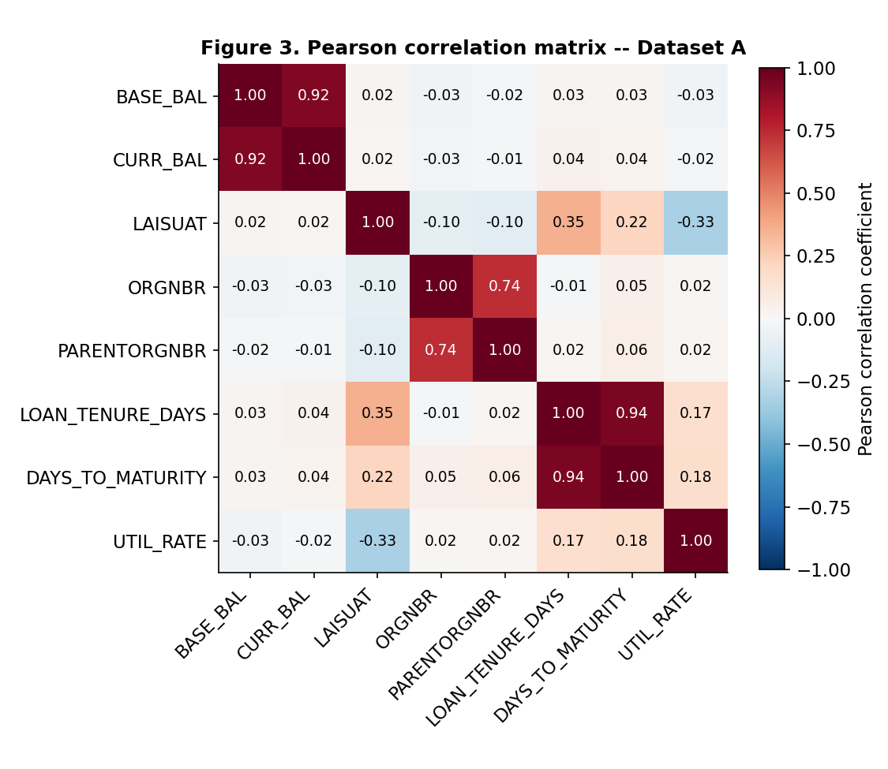
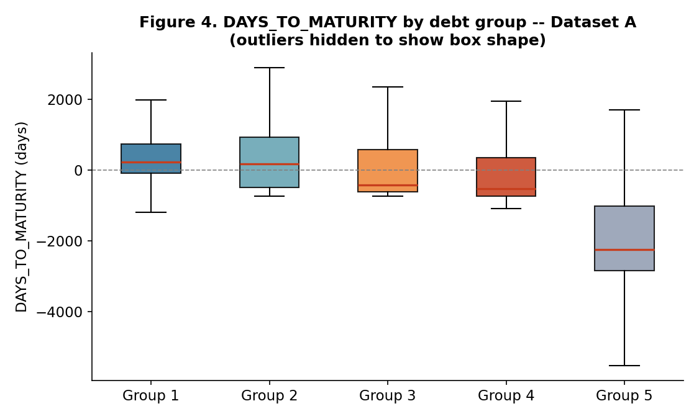
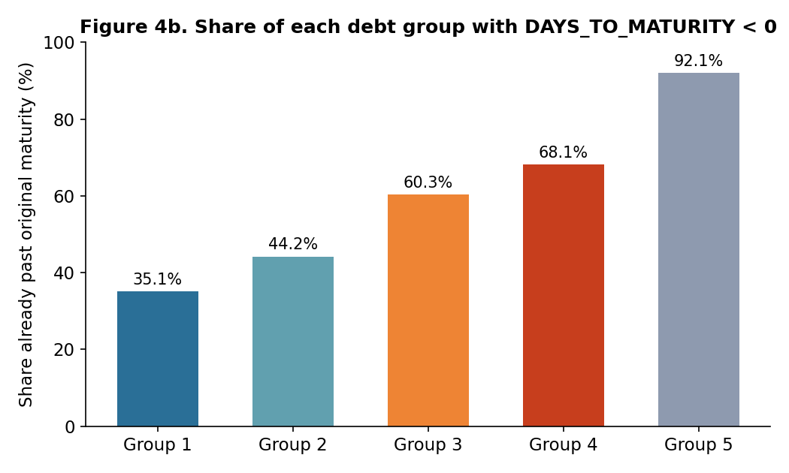
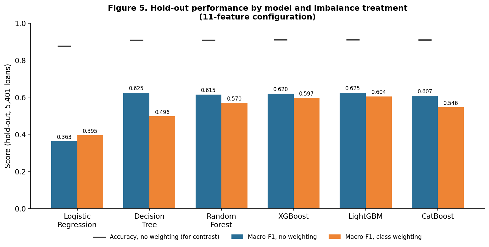
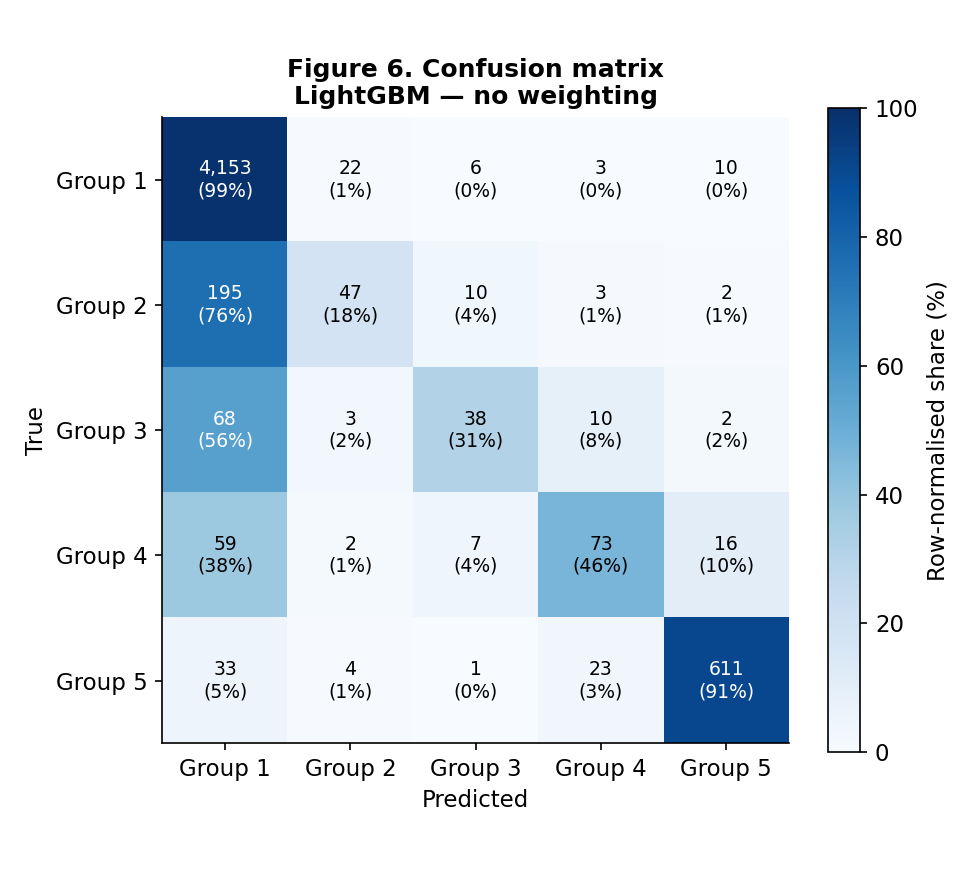
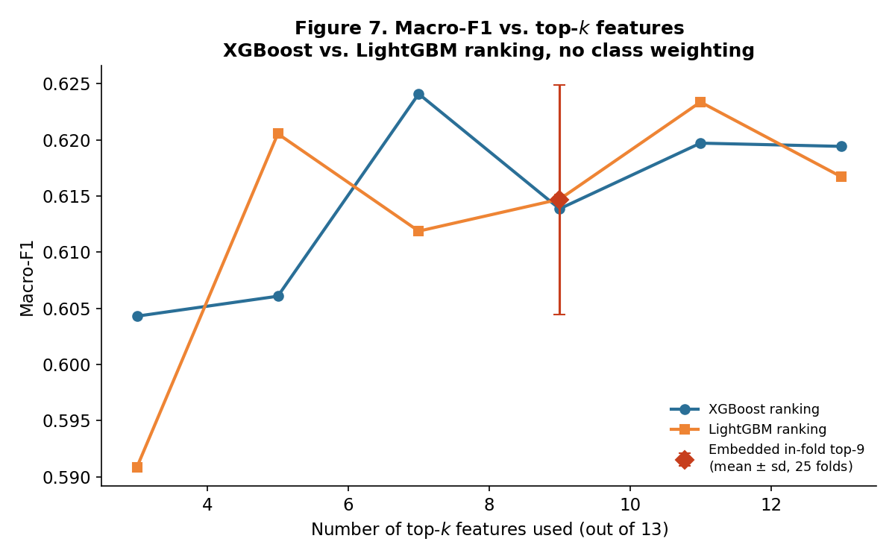
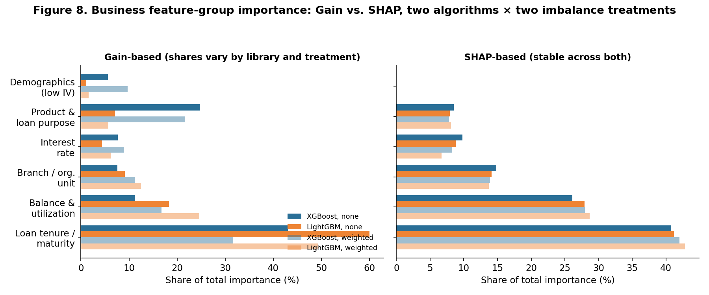
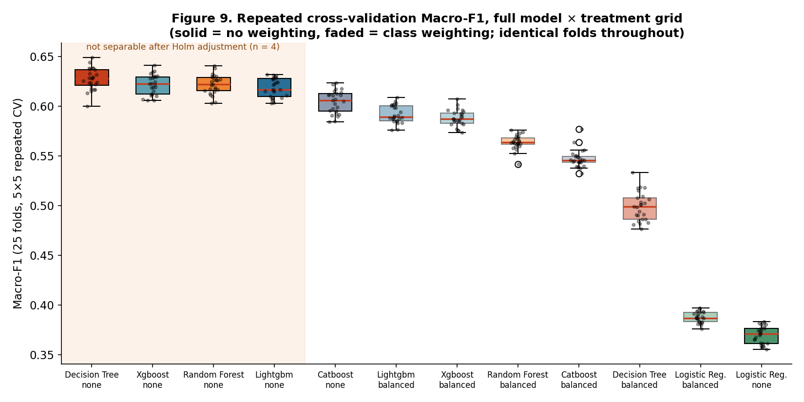

# Explainable Machine Learning for Credit Risk Classification: Evidence from a Vietnamese Commercial Bank and Implications for Sustainable Private-Sector Credit Governance

**Authors:** Lê Kim Thư; Đàm Công Danh (corresponding author)
**Affiliation:** School of Applied Mathematics and Informatics, Hanoi University of Science and Technology (HUST), Hanoi, Vietnam
**Corresponding author:** Đàm Công Danh — danh.dc251317M@sis.hust.edu.vn

*Submitted to the 3rd Global Conference on Sustainability in Economics, Business and Law (UEL SEBL International Conference 2026), "Green Economy and Sustainable Governance: New Growth Drivers for the Private Sector," Ho Chi Minh City, October 6, 2026.*

---

## Abstract

Robust credit-risk classification supports responsible private-sector lending. Using 27,001 loan contracts from a Vietnamese commercial bank, this study addresses three questions. First, among six classifiers under common class weighting, LightGBM performs best; testing the full model-by-strategy grid, four unweighted configurations — Decision Tree, XGBoost, Random Forest and LightGBM — are statistically indistinguishable after dependence and multiplicity corrections (repeated-CV Macro-F1 0.618–0.627), each significantly ahead of unweighted CatBoost ($p=0.0091$), showing algorithm ranking depends on imbalance treatment and that ensemble complexity is not automatically warranted. Second, nine-feature configurations retain approximately 98% of the best hold-out Macro-F1, while an embedded LightGBM check confirms only a small cross-validated reduction relative to 11 features. Third, consistently defined Gain and SHAP analyses identify loan maturity as the leading information group, although lower-ranked contributions remain model-dependent. Precision below 0.25 for Group 2 and unresolved temporal admissibility of `DAYS_TO_MATURITY` limit operational interpretation. Overall, the findings show that model choice, imbalance treatment, feature efficiency, and explanation methodology must be governed jointly.

**Keywords:** credit risk classification; class imbalance; explainable AI; model governance; Vietnam

---

## 1. Introduction

A growing private sector needs reliable access to bank credit at a fair, risk-appropriate cost, and reliable access depends on banks being able to classify credit risk soundly. Every commercial bank allocates credit through an internal risk-classification process, and the quality of that process determines how much credit reaches productive private borrowers, how consistently problem loans are identified, and how resilient the banking system remains through the credit cycle. Weak or opaque credit risk assessment works against this in two directions: it can restrict the flow of credit to bankable private borrowers because risk cannot be priced with confidence, or it can let risk accumulate unrecognised until it surfaces as non-performing loans (NPLs) that force banks to retrench lending precisely when the private sector needs it most.

This paper's contribution to the conference's "green economy and sustainable governance" theme is deliberately scoped to the governance half of that pairing, not the environmental half: it does not measure, model or classify green or environmentally sustainable lending, and no variable in the dataset used here identifies a loan's environmental purpose or impact. The contribution instead concerns *sustainable and responsible credit-risk governance* as an institutional capability — evaluated honestly under class imbalance, kept no more complex than the data justify, explained through more than one method, and checked rather than merely asserted — which is a precondition for a bank's overall lending capacity (green or otherwise) to be exercised responsibly and sustained over time. Readers looking for a direct measure of green-credit allocation will not find one in this paper; what follows is offered as infrastructure-level evidence for the private-sector-financing side of the conference theme.

In Vietnam, the classification of loans into risk-ordered debt groups is not a purely internal modelling choice; it is a regulatory obligation. Under the asset-classification framework currently in force — Circular No. 31/2024/TT-NHNN, as amended by Circular No. 37/2025/TT-NHNN and consolidated in Document No. 27/VBHN-NHNN dated 21 November 2025 — commercial banks, non-bank credit institutions and foreign bank branches must classify each loan into one of five debt groups of increasing risk, with groups 3–5 constituting non-performing debt. This classification underpins provisioning, portfolio monitoring and, ultimately, the volume and cost of credit a bank is willing and able to extend to private borrowers. A bank that can classify the current risk of its portfolio more accurately and more consistently — with less dependence on any single officer's judgement — is a bank that can govern its credit portfolio more soundly and support private-sector growth more confidently.

Machine learning offers a way to strengthen this classification process, but it also raises a governance concern that is directly relevant to a "sustainable governance" agenda: models that are accurate but opaque, or that unintentionally learn the labelling rule itself rather than genuine predictive signal, are unsuitable for a regulated, accountable credit process. Good governance of an AI-based credit model therefore requires three things simultaneously: predictive performance that is fairly measured under severe class imbalance; a feature set that is efficient and auditable rather than needlessly large; and an explanation of *why* the model classifies a given loan as it does.

This paper addresses these three requirements using a real dataset of 27,001 loan contracts from a Vietnamese commercial bank (`Data_credit_rating_VN.xlsx`), covering the debt-group target `NHOMNOMOI` (groups 1–5) and 21 raw variables describing the loan, the borrower and the branch. Building on a broader ongoing thesis-level research programme on AI applications in credit rating, this paper isolates and reports the full pipeline and results obtained on this single dataset, reframed around the following four questions, chosen for their direct relevance to credit governance and private-sector financing:

- **RQ1.** How do standard machine-learning classifiers compare on a multi-class, severely imbalanced debt-group classification task, using imbalance-aware evaluation metrics?
- **RQ2.** Does adding more features always improve out-of-sample performance, or can a smaller, cheaper-to-maintain feature set retain (near-)full performance?
- **RQ3.** Which business-defined groups of information (loan tenure, product/purpose, balance/utilization, branch, demographics, pricing) drive predictive performance, and is this conclusion stable across two different importance measures (Gain and SHAP)?
- **RQ4.** What do the answers to RQ1–RQ3 imply for how a bank should govern an AI-based credit-classification model in a way that supports — rather than restricts — sound private-sector credit allocation?

The remainder of the paper is organised as follows. Section 2 reviews the credit-scoring literature and the Vietnamese legal context. Section 3 describes the data, the preprocessing and leakage-control pipeline, the engineered features, and the modelling and evaluation design. Section 4 reports the empirical results. Section 5 discusses the implications for sustainable credit governance and private-sector financing. Section 6 concludes and states the limitations of the study.

## 2. Literature Review and Institutional Context

### 2.1 From statistical scoring to machine learning

Credit scoring has a long statistical tradition. Altman (1968) introduced the multivariate discriminant Z-score on a matched sample of 66 U.S. manufacturing firms, reporting about 95% correct classification one year before bankruptcy — a result obtained on a small, artificially balanced sample and therefore not directly transferable as an accuracy benchmark to a modern, imbalanced retail-banking dataset. Ohlson (1980) moved the field toward probabilistic prediction with a logit model estimated on a much larger and more realistic sample (105 bankrupt vs. 2,058 non-bankrupt firms). In consumer credit, Hand and Henley (1997) and Thomas (2000) systematised the statistical foundations of credit and behavioural scoring; logistic regression became — and remains — the industry baseline because of its transparent, additive log-odds structure (Hosmer et al., 2013).

The 2000s and 2010s extended the toolkit substantially. Random Forest (Breiman, 2001) reduces variance relative to a single decision tree (Quinlan, 1986) by averaging over bootstrap-sampled, decorrelated trees. Gradient Boosting (Friedman, 2001) fits an additive sequence of weak learners to residual error. XGBoost (Chen & Guestrin, 2016), LightGBM (Ke et al., 2017) and CatBoost (Prokhorenkova et al., 2018) are, respectively, a regularised and scalable boosting framework, a histogram/leaf-wise boosting framework optimised for large, high-dimensional tabular data, and a boosting framework with native handling of categorical features. Large-scale benchmarking studies caution against assuming any one family is uniformly best: Baesens et al. (2003) found that non-linear classifiers did not dominate logistic regression consistently across eight European and U.S. credit datasets, while Lessmann et al. (2015), updating that benchmark on 41 classifiers and 8 datasets, found that many classifiers outperform logistic regression and that heterogeneous ensembles perform well on average, but that rankings vary by dataset and metric. Brown and Mues (2012) show, across five real credit datasets under class ratios pushed from 70/30 to an extreme 99/1, that the best-performing algorithm changes with the degree of imbalance, with Random Forest performing best at the most extreme imbalance level they test.

### 2.2 Class imbalance, evaluation and explainability

Credit datasets are structurally imbalanced: good loans vastly outnumber bad ones. Under such imbalance, Accuracy is a misleading headline metric because a trivial "always predict good" classifier can score deceptively well; Macro-F1, which averages F1 across classes without weighting by class frequency, is a more informative primary metric because it penalises poor detection of rare, high-risk classes (Brown & Mues, 2012). The Synthetic Minority Over-sampling Technique (SMOTE; Chawla et al., 2002) is a widely used resampling method to counteract imbalance, but it must be fitted only within the training partition to avoid leaking synthetic-neighbour information into the evaluation set. Beyond raw predictive performance, credit-risk models used in a regulated setting must also be explainable. SHAP (SHapley Additive exPlanations), grounded in cooperative game theory, attributes each prediction additively to its input features at both the individual and the aggregate level (Lundberg & Lee, 2017), and is increasingly treated as a governance tool rather than a purely technical add-on, precisely because it lets a bank show, feature by feature, why a given loan was scored as it was.

A complementary, older but still standard tool for feature screening in credit scoring is the Weight of Evidence / Information Value (WOE/IV) framework (Siddiqi, 2006), which quantifies how well a single variable separates "good" from "bad" outcomes before any model is fitted, using conventional thresholds (IV < 0.02 "useless," 0.02–0.1 "weak," 0.1–0.3 "medium," 0.3–0.5 "strong," 0.5–1.0 "very strong," and > 1.0 flagged as "suspiciously high," a common heuristic trigger to check for data leakage). This last threshold matters for governance: an unusually high IV is not proof of leakage, but it is a signal that a variable's availability at scoring time must be verified before the variable is used — a discipline this paper applies explicitly in Section 3.

### 2.3 Legal and institutional context in Vietnam, and its alignment with this dataset's timing

The target variable used in this paper is not an arbitrary research construct: it is the debt group assigned to each loan under Vietnam's binding regulatory framework for asset classification, which has been revised several times. Decision No. 493/2005/QĐ-NHNN (as amended by Decision No. 18/2007/QĐ-NHNN) first codified the five-group debt-classification structure retained in every subsequent version. Circular No. 02/2013/TT-NHNN (as amended by Circular No. 09/2014/TT-NHNN) replaced Decision 493; Circular No. 11/2021/TT-NHNN, effective 1 October 2021, then replaced Circular 02/2013; and Circular No. 31/2024/TT-NHNN, effective 1 July 2024 and further amended by Circular No. 37/2025/TT-NHNN (consolidated in Document No. 27/VBHN-NHNN, 21 November 2025), is the framework currently in force. Across all versions, assets are classified into five debt groups of increasing risk, with groups 3, 4 and 5 constituting non-performing debt. In parallel, the National Credit Information Center of Vietnam (CIC), operating under Circular No. 15/2023/TT-NHNN, aggregates cross-institution credit-history information used in classification and monitoring.

The dataset does not record its classification date, so the operative circular cannot be established from the file alone. If the snapshot predates 1 October 2021, Circular No. 02/2013/TT-NHNN would be the relevant framework; if it postdates that point, Circular No. 11/2021/TT-NHNN would apply. The paper therefore makes the narrower claim that `NHOMNOMOI` appears to operationalise Vietnam's long-standing regulator-defined five-group structure, while the exact legal instrument and bank-internal assignment rules remain unverified. Circular No. 31/2024/TT-NHNN is cited only when discussing the framework currently in force. Irrespective of the precise historical instrument, any input that restates the classification rule or becomes known only after classification must be excluded to avoid trivial, non-generalisable classification.

### 2.4 Prior machine-learning credit-scoring work in Vietnam and the research gap

Several recent studies have applied machine learning to credit risk at Vietnamese commercial banks. Dang and Nguyen (2020) built an early credit-scoring pipeline for a Vietnamese bank; Trung and Vuong (2025) developed a credit-scoring model for individual Vietnamese bank customers comparing Logistic Regression, k-nearest neighbours, Decision Tree, Random Forest, LightGBM and SVM; Nguyen and Ngo (2025) compared four boosting algorithms (AdaBoost, XGBoost, LightGBM, CatBoost) for personal default prediction on a pooled dataset of 7,542 customers from Vietnamese commercial banks and financial institutions (2014–2022); and, closest in subject to the present paper, Nguyen et al. (2024) built an early-warning system for debt-group migration at one Vietnamese commercial bank, comparing Logistic Regression, SVM, Decision Tree and Random Forest and reporting up to 81.84% Accuracy for a Random Forest model predicting overdue-debt migration.

These studies establish that machine learning is an active, competitive area of Vietnamese banking research and that ensemble/boosting methods are strong candidates in this setting, but three gaps in this literature motivate the present paper's design. First, model comparisons are typically reported using Accuracy as the headline metric — including the 81.84% figure above — without a class-imbalance-robust primary metric such as Macro-F1; Section 4.1 of this paper shows directly, on this same category of data, how misleading Accuracy can be under severe imbalance (CatBoost's Accuracy and Macro-F1 diverge sharply). Second, none of these studies checks whether its feature-importance conclusions are stable across more than one algorithm or more than one importance measure; Section 4.3 shows that Gain-based importance computed from two different tree-boosting libraries on the *same* Vietnamese dataset can disagree sharply with each other, a methodological caution directly relevant to any single-model importance analysis in this literature. Third, none reports an explicit leakage diagnostic for a dominant predictor, an ablation study, or a check of sensitivity to an arbitrary modelling convention such as a reference date — verification steps this paper treats as a governance requirement (Section 5) rather than an optional robustness check. The present paper's contribution is accordingly not one more machine-learning model for a Vietnamese bank, but a demonstration of a verification-first methodology — cross-model importance triangulation, a leakage ablation, a reference-date sensitivity check, and imbalance-metric discipline with a properly specified statistical test — that this literature has not yet applied together, and that this paper argues should be a governance baseline before a model of this kind informs credit decisions affecting private-sector borrowers.

## 3. Data and Methodology

### 3.1 Dataset

The dataset (`Data_credit_rating_VN.xlsx`) contains 27,001 loan contracts from a Vietnamese commercial bank and 21 raw variables, with no missing values in the target variable `NHOMNOMOI` (debt group, 1–5), which is defined per the classification framework described in Section 2.3. Table 1 reports the class distribution together with the stratified 80/20 train/test split (`random_state = 42`) used throughout.

**Table 1. Debt-group distribution in Dataset A**

| Group | Total | Share (%) | Train | Test |
|---|---:|---:|---:|---:|
| 1 (standard) | 20,965 | 77.65 | 16,771 | 4,194 |
| 2 (special mention) | 1,287 | 4.77 | 1,030 | 257 |
| 3 (sub-standard) | 604 | 2.24 | 483 | 121 |
| 4 (doubtful) | 784 | 2.90 | 627 | 157 |
| 5 (loss) | 3,361 | 12.45 | 2,689 | 672 |
| **Total** | **27,001** | **100.00** | **21,600** | **5,401** |

The imbalance ratio between the largest and smallest groups is approximately 35:1 (Group 1 vs. Group 3), which motivates the imbalance-aware modelling and evaluation choices described below.

The raw file does not contain an explicit "as-of" or classification-date field, so this paper treats the 27,001 records as a single cross-sectional snapshot rather than a panel spanning multiple classification dates. Two pieces of indirect evidence support, without conclusively proving, this reading. First, a three-valued field named `ID_TIME` initially raised the possibility that the data spans multiple reporting periods; direct inspection shows it instead encodes loan tenor category (short/medium/long-term), not a time period, so it provides no evidence of multi-date pooling. Second, `OPEN_DATE` is heavily concentrated in 2016–2019, falls to five records in 2020, and contains none after 8 November 2020 — a pattern consistent with a single extraction of the active loan book taken shortly after that date, though it does not rule out staggered classification dates within the book. Because this cannot be verified independently from the data, the fixed reference date $d_0 = $ 31 December 2021 used below (Section 3.4) should be read as a modelling convention consistent with the wider pipeline rather than a value read from a recorded snapshot-date field; this is stated explicitly as an assumption and revisited in Section 6.

*Figure 1. Debt-group distribution in Dataset A (n = 27,001). Group 1 (standard debt) alone accounts for 77.6% of loan contracts, while the three non-performing groups (3–5) together account for only 17.6%.*

### 3.2 Data cleaning

Before computing descriptive statistics, the two date fields `OPEN_DATE` and `NGAYDENHAN` (maturity date) were checked for format consistency. A substantial share of records stored dates as Excel serial-date integers rather than `dd/mm/yyyy` text strings — 36.84% of `OPEN_DATE` (9,949 records) and 36.63% of `NGAYDENHAN` (9,890 records). Because the original date parser only recognised text-formatted dates, applying it without this check would have silently converted more than a third of records to missing values. Serial-date values were therefore converted using the Excel epoch (30 December 1899); after cleaning, both fields had zero missing or unparsed records.

The five raw numeric variables (`BASE_BAL`, `CURR_BAL`, `LAISUAT` [interest rate], `ORGNBR`, `PARENTORGNBR`) show strong right skew typical of monetary variables in banking data — for instance, the standard deviation of `BASE_BAL` (6.40×10⁹) is more than ten times its mean (4.28×10⁸) — and elevated Interquartile-Range (IQR) outlier rates for the two balance variables (`CURR_BAL`: 9.12%; `BASE_BAL`: 7.13%), consistent with a small number of very large corporate-type exposures within an otherwise retail-dominated book.

*Figure 2. Distribution of key numeric variables in Dataset A. `BASE_BAL` and `CURR_BAL` are plotted on a log₁₀ scale to reveal their approximately log-normal shape; `UTIL_RATE` shows a visible spike at the clip boundary of 10, confirming that the clipping rule in Section 3.4 is binding for a non-trivial share of contracts; `DAYS_TO_MATURITY` is markedly bimodal around zero, separating loans already past their reference-date maturity from loans with substantial remaining tenor.*

### 3.3 Leakage control

This stage addresses the third research gap identified in Section 2.4: prior Vietnamese credit-scoring studies rarely document an explicit diagnostic for predictors that may encode the outcome being modelled. The risk is especially material here because `NHOMNOMOI` is a regulator-defined debt-group classification and the source file contains neighbouring fields produced by the same credit-monitoring process. A model trained on a current or earlier debt-group field could achieve apparently strong out-of-sample scores by reproducing the bank's classification rule, rather than by learning a relationship that would remain valid when the model is applied to genuinely new observations.

We therefore applied a two-part admissibility criterion before modelling: an input must be available no later than the intended classification point and must not be a direct or derived restatement of `NHOMNOMOI`. On this basis, `NHOMNO` was excluded because it is an alternate debt-group field with a Pearson correlation of 0.98 with the target, while `NHOMNO_TCBS` was excluded because it is a text-coded restatement of debt group. These exclusions are treated as leakage control, not ordinary feature selection: retaining either variable would compromise the validity of every subsequent comparison, irrespective of the algorithm used.

The remaining removals address redundancy and lack of usable information rather than target leakage. `DUNO_QD` duplicates the outstanding-balance information, `MJACCTTYPDESC` is a free-text description of the coded product field, and constant or near-uninformative fields cannot support stable discrimination. After these rules, 13 variables remain as the candidate-admissible pool. This initial screen is deliberately not presented as conclusive proof that every retained variable is leakage-free. Instead, it establishes an auditable first filter that is followed by the IV-based review in Section 3.5 and the ablation and reference-date checks in Section 4.2. The resulting sequence—semantic screening, quantitative flagging, and falsifiable robustness tests—is the study's concrete methodological response to the leakage-diagnostic gap in the prior literature.

### 3.4 Feature engineering

Three engineered variables were constructed from the cleaned date and balance fields, using a fixed reference date $d_0 = $ 31 December 2021 so that results are reproducible across re-runs:

$$
\mathit{LOAN\_TENURE\_DAYS}_i = \max\{0,\; d_i^{\mathrm{maturity}} - d_i^{\mathrm{open}}\}, \qquad
\mathit{DAYS\_TO\_MATURITY}_i = d_i^{\mathrm{maturity}} - d_0
$$

$$
\mathit{UTIL\_RATE}_i =
\begin{cases}
\operatorname{clip}\!\left(\dfrac{\mathit{CURR\_BAL}_i}{\mathit{BASE\_BAL}_i},\,0,\,10\right), & \mathit{BASE\_BAL}_i>0 \\[4pt]
0, & \mathit{BASE\_BAL}_i \le 0
\end{cases}
$$

where $\operatorname{clip}(u;0,10)=\min\{\max(u,0),10\}$ caps the utilization ratio at ten times the original balance, preventing a small number of extreme ratios (from additional disbursements) from dominating the standardisation step used by the linear baseline. `DAYS_TO_MATURITY` has the highest IQR-outlier rate (23.08%) because it is legitimately bimodal — negative for loans already past maturity at the reference date and positive, sometimes far so, for long-tenor loans — a business feature, not a data error. `LOAN_TENURE_DAYS` and `DAYS_TO_MATURITY` are strongly correlated ($r=0.942$), as expected since both derive from the same two date fields; `BASE_BAL` and `CURR_BAL` are similarly correlated ($r=0.923$). No pair exceeds $|r|=0.95$, so no variable was dropped purely on correlation grounds, but this correlation structure is kept in mind when interpreting tree-based importance measures in Section 4.

*Figure 3. Pearson correlation matrix of the eight numeric variables of Dataset A. The three high-correlation pairs discussed in the text (`LOAN_TENURE_DAYS`–`DAYS_TO_MATURITY`, `BASE_BAL`–`CURR_BAL`, `ORGNBR`–`PARENTORGNBR`) stand out as the darkest off-diagonal cells.*

*Figure 4. Distribution of `DAYS_TO_MATURITY` by debt group (outliers hidden to show box shape). The median falls fairly steadily from Group 1 to Group 4 and then drops sharply for Group 5, foreshadowing why this variable emerges as the dominant predictor in the SHAP analysis of Section 4.3 — while also showing that the relationship is not strictly monotonic, a caution against over-interpreting it causally.*

### 3.5 Feature screening with Information Value (IV)

Following the WOE/IV convention (Siddiqi, 2006), IV was computed for all 13 admissible variables (Table 2). Five variables exceed the conventional IV = 1.0 threshold that flags a possible leakage risk. Rather than excluding them automatically, each was manually checked against the leakage criterion stated in Section 2.3 — availability at or before the classification date — and retained, because `DAYS_TO_MATURITY`, `LOAN_TENURE_DAYS` and `UTIL_RATE` are computed strictly from origination/maturity dates and balances known at scoring time, and `CURRMIACCTTYPCD` (31-category product sub-type) and `MUCDICHVAY` (79-category loan purpose) are contractual attributes fixed at origination, not outcomes of the classification process itself. This distinguishes them from `NHOMNO`/`NHOMNO_TCBS`, which were excluded in Section 3.3 precisely because they *are* restatements of the target. We report this distinction explicitly because it illustrates a governance point developed further in Section 5: an automatic IV-based leakage flag is a prompt for human review, not a substitute for it.

**Table 2. Information Value of the 13-variable pool (Dataset A)**

| Feature | IV | Level |
|---|---:|---|
| `DAYS_TO_MATURITY` | 4.554 | High IV — reviewed, retained (available at scoring time) |
| `CURRMIACCTTYPCD` | 1.992 | High IV — reviewed, retained |
| `LOAN_TENURE_DAYS` | 1.941 | High IV — reviewed, retained |
| `MUCDICHVAY` | 1.414 | High IV — reviewed, retained |
| `UTIL_RATE` | 1.333 | High IV — reviewed, retained |
| `MJACCTTYPCD` | 0.970 | Very strong |
| `LAISUAT` (interest rate) | 0.785 | Very strong |
| `BASE_BAL` | 0.536 | Very strong |
| `PARENTORGNBR` | 0.320 | Strong |
| `CURR_BAL` | 0.259 | Medium |
| `ORGNBR` | 0.182 | Medium |
| `SEX` | 0.008 | Useless |
| `LOAIKH` (customer type) | 0.000 | Useless |

Because `SEX` and `LOAIKH` carry effectively no separating information, the **main modelling configuration uses the remaining 11 features** (the 13-variable pool minus these two), while the full 13-variable pool is retained for the top-*k* feature-efficiency experiment in Section 4.2.

**A closer look at `DAYS_TO_MATURITY`.** Its IV of 4.554 is markedly higher than any other admissible variable, and — as Section 4.3 shows — it is also the single dominant SHAP predictor under both models tested. This combination warrants a direct check of whether the variable is a genuine, non-deterministic risk signal or, like `NHOMNO` in Section 3.3, effectively a restatement of the classification rule. Two definitional points bound the concern before turning to the data: `DAYS_TO_MATURITY` is computed from `NGAYDENHAN`, the loan's *original contractual* maturity date, not from a payment-due date; and the raw 21-column file contains no "days overdue on payment" / "days past due" field of any kind, so the two concepts cannot be compared directly — only inferred indirectly, as done here.

Table 2b reports the distribution of `DAYS_TO_MATURITY` by debt group and the share of each group already past its original maturity date ($\text{DAYS\_TO\_MATURITY} < 0$) as of the reference date.

**Table 2b. `DAYS_TO_MATURITY` by debt group, and share already past original maturity**

| Group | Mean | Median | Min | Max | Share with `DAYS_TO_MATURITY` < 0 |
|---|---:|---:|---:|---:|---:|
| 1 (standard) | 1,112.0 | 224 | −3,252 | 16,798 | 35.1% |
| 2 (special mention) | 733.2 | 172 | −724 | 6,549 | 44.2% |
| 3 (sub-standard) | 327.8 | −418 | −727 | 6,547 | 60.3% |
| 4 (doubtful) | 54.4 | −517 | −1,085 | 6,520 | 68.1% |
| 5 (loss) | −1,884.8 | −2,236 | −5,513 | 6,495 | 92.1% |

*Figure 4b. Share of loans with `DAYS_TO_MATURITY` < 0 (already past their original contractual maturity date), by debt group. The share rises with risk but is far from a 0%/100% step function at any group boundary — over a third of Group-1 loans are already past original maturity, and almost 8% of Group-5 loans are not — the pattern discussed in the text.*

The mean and median fall monotonically from Group 1 to Group 5, the pattern that motivates a leakage concern in the first place. However, two features of Table 2b argue against `DAYS_TO_MATURITY` being a simple restatement of the labelling rule. First, 35.1% of Group-1 (standard, lowest-risk) loans are already past their *original* maturity date yet remain classified as standard — plausibly short-term working-capital loans that were rolled over or renewed without a change in risk classification, a common practice in Vietnamese commercial lending. If the variable directly encoded the overdue-payment criterion used for classification, this share should be close to zero. Second, 7.9% of Group-5 (loss, highest-risk) loans are *not* past their original maturity, indicating that `NHOMNOMOI` also reflects information beyond original-maturity status (e.g., restructuring history or other qualitative criteria under Circular No. 11/2021/TT-NHNN, the framework applicable to this dataset per Section 2.3). As a more direct quantitative check, a univariate rule that predicts "non-performing" whenever $\text{DAYS\_TO\_MATURITY} < 0$ and "performing" otherwise reconstructs the binary good/bad split (Groups 2–5 vs. Group 1) with only 67.3% accuracy and an F1-score of 0.508 on the non-performing class over the full 27,001-record dataset — far from the near-perfect reconstruction that would indicate the variable is algebraically equivalent to the label, and in clear contrast to `NHOMNO` in Section 3.3, whose 0.98 correlation with the target was the basis for its exclusion.

Taken together, this evidence is consistent with `DAYS_TO_MATURITY` being a strong, economically plausible predictor — a loan sitting well past its original maturity without formal renewal is a reasonable indicator of distress — rather than a hidden copy of the classification outcome. It does not, however, amount to proof: the exact quantitative criteria the source bank uses to assign `NHOMNOMOI` are not documented in the dataset, so a residual possibility that part of the variable's predictive power reflects an unobserved overdue-payment field correlated with it cannot be fully excluded from the data alone. This is stated as an explicit limitation in Section 6, together with a recommendation to confirm the variable's relationship to the bank's internal classification methodology before any operational use.

### 3.6 Models, imbalance handling and evaluation

Six classifiers were trained and compared: Logistic Regression, Decision Tree, Random Forest, XGBoost, LightGBM and CatBoost, all trained and evaluated in a single software environment (`scikit-learn` 1.9.0, `xgboost` 3.3.0, `lightgbm` 4.7.0, `catboost` 1.2.10; full versions in the Reproducibility Statement) so that every number reported below is directly comparable. All numerical preprocessing (imputation, standardisation) was fitted on the training partition only, to prevent information from the test partition from influencing model training.

Class imbalance was handled with **class weighting** (`class_weight = "balanced"` for Logistic Regression, Decision Tree, Random Forest and LightGBM; equivalent inverse-frequency `sample_weight` for XGBoost; `auto_class_weights = "Balanced"` for CatBoost) rather than SMOTE. Five of the eleven features are categorical, including the nominal branch identifiers `ORGNBR` and `PARENTORGNBR`; treating these identifiers as continuous quantities would impose meaningless distances. For the five non-CatBoost models they are label-encoded, a remaining limitation stated in Section 6, while CatBoost retains native categorical handling. SMOTE was rejected because interpolation between encoded category values can generate synthetic values with no contractual meaning. A pilot check showed that class weighting can itself substantially reduce CatBoost's performance; rather than assume this is CatBoost-specific, Section 4.4 evaluates **every** one of the six models under both weighting settings, on the same repeated cross-validation folds, before any cross-model ranking is drawn. Models were evaluated on the stratified 20% hold-out set (Table 1) using four metrics:

$$
\mathrm{Accuracy}=\frac{\sum_{k=1}^{K}C_{kk}}{N}, \qquad
F1_{\mathrm{macro}}=\frac{1}{K}\sum_{k=1}^{K}F1_k, \qquad
F1_{\mathrm{weighted}}=\sum_{k=1}^{K}\frac{n_k}{N}F1_k, \qquad
\mathrm{AUC}_{\mathrm{macro,OvR}}=\frac{1}{K}\sum_{k=1}^{K}\mathrm{AUC}\bigl(y^{(k)},\hat p^{(k)}\bigr)
$$

with $K=5$ classes. Because Group 1 alone accounts for 77.65% of observations, Accuracy is reported for completeness but **Macro-F1 is treated as the primary criterion**, consistent with the imbalance literature reviewed in Section 2.2. Per-class Precision/Recall/F1 and the full $5\times5$ confusion matrix are also reported for the top model (Section 4.1), because Macro-F1 alone does not show *which* debt groups drive a model's score. Because a single stratified split can make a small, split-specific gap between two close models look more decisive than it is, the single-split comparison in Table 3 is supplemented with a repeated stratified cross-validation check (5-fold, 5 repeats, 25 train/test partitions per model) that reports Macro-F1 as a mean $\pm$ standard deviation for each of the six models, together with a **corrected resampled paired $t$-test** (Nadeau & Bengio, 2003) comparing the top model against every other model — an explicit correction for the fact that folds within repeated $k$-fold CV share data and are not independent, so a naive paired $t$-test or Wilcoxon test on the same folds understates variance and overstates significance (Section 4.4).

Feature importance was assessed with two independent measures: Gain (split-based importance native to the tree-boosting libraries) and mean absolute SHAP value (via `TreeExplainer`), computed on the full 5,401-observation test set for the 11-feature main configuration. Because the feature-analysis module in this pipeline defaults to XGBoost, the top-$k$ curve and Gain/SHAP importance analysis are reported for both XGBoost and LightGBM throughout Section 4, so that the paper's feature-level conclusions do not rest on one algorithm's internal ranking behaviour. Three additional checks probe whether this ranking-based design is trustworthy: an **ablation** that removes the dominant predictor, `DAYS_TO_MATURITY`, from the feature set entirely (Section 4.2); a **reference-date sensitivity check** that re-derives `DAYS_TO_MATURITY` and refits the model under five different values of $d_0$ (Section 4.2); and an **embedded (in-fold) feature-selection** variant of the top-$k$ experiment, in which the ranking used to select the top 9 features is computed from each cross-validation fold's training partition only, rather than from a ranking that could be informed by repeated looks at the test partition (Section 4.2).

## 4. Empirical Results

### 4.1 Model comparison (RQ1)

**Table 3. Out-of-sample results on the 11-feature main configuration (class weighting)**

| Model | Accuracy | Macro-F1 | Weighted-F1 | ROC-AUC (macro) |
|---|---:|---:|---:|---:|
| Logistic Regression | 0.6091 | 0.3946 | 0.6886 | 0.7744 |
| Decision Tree | 0.6441 | 0.4962 | 0.7243 | 0.8647 |
| Random Forest | 0.7784 | 0.5699 | 0.8229 | 0.9071 |
| XGBoost | 0.8298 | 0.5966 | 0.8556 | 0.9147 |
| **LightGBM** | **0.8548** | **0.6044** | **0.8713** | **0.9128** |
| CatBoost | 0.7730 | 0.5460 | 0.8192 | 0.9062 |

*Figure 5. Accuracy, Macro-F1, Weighted-F1 and ROC-AUC (macro) for the six models compared in Table 3, under the class-weighting methodology adopted in Section 3.6.*

Under the common class-weighting treatment, LightGBM attains the best point estimate on all four metrics. Logistic Regression and the depth-constrained Decision Tree perform substantially worse, but the present design does not isolate whether this is caused by functional form, category encoding or sensitivity to weighting. CatBoost's weighted result is also treatment-sensitive, so Section 4.1 reports its unweighted configuration and Section 4.4 evaluates both configurations on identical repeated-CV folds.

**Table 4. LightGBM confusion matrix and per-class metrics, 11-feature main configuration**

| True \\ Pred | 1 | 2 | 3 | 4 | 5 | Precision | Recall | F1 | Support |
|---|---:|---:|---:|---:|---:|---:|---:|---:|---:|
| **1** | 3,755 | 323 | 54 | 47 | 15 | 0.958 | 0.895 | 0.926 | 4,194 |
| **2** | 99 | 121 | 21 | 15 | 1 | 0.245 | 0.471 | 0.323 | 257 |
| **3** | 24 | 27 | 50 | 18 | 2 | 0.350 | 0.413 | 0.379 | 121 |
| **4** | 31 | 13 | 14 | 86 | 13 | 0.411 | 0.548 | 0.470 | 157 |
| **5** | 11 | 9 | 4 | 43 | 605 | 0.951 | 0.900 | 0.925 | 672 |
| *Macro avg* | | | | | | *0.583* | *0.645* | *0.604* | *5,401* |

*Rows are true debt groups, columns are predicted debt groups; e.g., row 3 shows that of the 121 loans truly in Group 3, the model predicted 50 correctly, 24 as Group 1, 27 as Group 2, 18 as Group 4 and 2 as Group 5. The corresponding table for XGBoost is reported in Appendix B (Table B1).*

*Figure 8. Row-normalised confusion matrix for LightGBM (Table 4). The darkest cells on the diagonal (Groups 1 and 5) show where the model is most reliable; the lighter, more spread-out rows for Groups 2–4 show where its flags require more caution.*

Table 4 shows what Macro-F1 alone does not: Group 2 has Precision below 0.25, and Group 3 remains well below 0.4. Errors are not confined to adjacent groups: 24 true Group-3 loans and 31 true Group-4 loans are assigned to Group 1, indicating operationally important under-classification. Group 3 has only 121 test observations, so these single-split estimates carry substantial sampling uncertainty.

**Table 5. CatBoost ablation: `auto_class_weights` substitution**

| Setting | `auto_class_weights` | Accuracy | Macro-F1 | Weighted-F1 | ROC-AUC |
|---|---|---:|---:|---:|---:|
| Class weighting (Table 3) | Balanced | 0.7730 | 0.5460 | 0.8192 | 0.9062 |
| Alternative configuration | None | 0.9093 | **0.6074** | 0.8911 | 0.9235 |

Turning `auto_class_weights` off raises CatBoost's hold-out Macro-F1 by 0.061. Section 4.4 shows this pattern — unweighted outperforming class-weighted — is not unique to CatBoost: it holds for all six models tested, so this single-model ablation is not evidence that CatBoost–none is the best configuration overall. It does show that algorithm and imbalance treatment must be selected jointly. Section 4.4 evaluates every model, unweighted and weighted, on the same repeated folds, and identifies the best-supported configuration from the full grid rather than from this partial comparison.

### 4.2 Feature efficiency: does more always help, and is the strongest predictor doing something suspicious? (RQ2)

**`DAYS_TO_MATURITY` ablation.** Table 6 refits the 11-feature main configuration with `DAYS_TO_MATURITY` removed (10 features), for both XGBoost and LightGBM.

**Table 6. Effect of removing `DAYS_TO_MATURITY` from the 11-feature configuration**

| Model | Macro-F1 (11 features) | Macro-F1 (10 features, no DTM) | Change | ROC-AUC (10 features) |
|---|---:|---:|---:|---:|
| XGBoost | 0.5966 | 0.4995 | $-$0.0971 ($-$16.3%) | 0.8693 |
| LightGBM | 0.6044 | 0.5052 | $-$0.0992 ($-$16.4%) | 0.8673 |

Removing the most SHAP-important variable costs both models approximately 16% of Macro-F1, establishing that it contributes non-redundant predictive information. This ablation does **not** establish temporal admissibility or rule out proxy leakage: a proxy can coexist with other genuine or proxy predictors, leaving material performance after removal. The source bank's classification methodology and actual snapshot date are still required for that determination.

**Reference-date invariance.** Only `DAYS_TO_MATURITY`, not `LOAN_TENURE_DAYS`, depends on $d_0$. Replacing $d_0$ with five dates from 2020-12-31 to 2023-12-31 leaves LightGBM performance unchanged (Macro-F1 = 0.6044; ROC-AUC = 0.9128). This follows by construction: changing $d_0$ adds the same constant to every record and therefore preserves all tree partitions. The check resolves only the narrow concern that the numerical choice of $d_0$ could be tuned to inflate tree-model performance; it does not identify the true snapshot date, establish feature availability at classification, or rule out proxy leakage.

**Embedded (in-fold) feature selection.** The exploratory top-$k$ curve repeatedly consults one hold-out set. As a check, LightGBM was rerun in 5-fold $\times$ 5-repeat CV with the ranking recomputed inside each training fold. The value $k=9$ was fixed before this verification, but was motivated by earlier exploratory results and was not prespecified before the overall study. The embedded result is Macro-F1 = 0.5878 $\pm$ 0.0101, compared with 0.5917 $\pm$ 0.0089 for the fixed 11-feature LightGBM configuration.

**Table 7. Macro-F1 and ROC-AUC by number of top-$k$ features (13-variable pool), XGBoost vs. LightGBM ranking**

| $k$ | XGBoost Macro-F1 | XGBoost ROC-AUC | LightGBM Macro-F1 | LightGBM ROC-AUC |
|---:|---:|---:|---:|---:|
| 3  | 0.4819 | 0.8765 | 0.5324 | 0.8879 |
| 5  | 0.5516 | 0.8986 | 0.5724 | 0.9039 |
| 7  | 0.5903 | 0.9162 | 0.5911 | 0.9091 |
| 9  | 0.5944 | 0.9170 | 0.5966 | 0.9107 |
| 11 | 0.5899 | 0.9161 | 0.6065 | 0.9126 |
| 13 (full pool) | **0.6036** | **0.9174** | **0.6077** | **0.9127** |

*Figure 6. Macro-F1 as a function of the number of top-ranked features used, XGBoost vs. LightGBM ranking (Table 7), under class weighting.*

For both models, nine features recover approximately 98% of the best hold-out Macro-F1 in Table 7. The embedded verification supports this result for LightGBM only; it should not be generalised to XGBoost without an equivalent in-fold analysis. The curve is sufficiently flat over $k=7$ to $13$ that no unique optimum is established.

### 4.3 Contribution of business feature groups: Gain vs. SHAP (RQ3)

**Table 8. Gain-based group importance — XGBoost vs. LightGBM (13-variable pool, class weighting)**

| Business group | XGBoost Gain (%) | LightGBM Gain (%) |
|---|---:|---:|
| Product & loan purpose | 21.7 | 5.7 |
| Loan tenure / maturity | **31.7** | **49.3** |
| Balance & utilization | 16.8 | 24.6 |
| Branch / organisational unit | 11.2 | 12.5 |
| Interest rate | 9.0 | 6.2 |
| Demographics (low IV) | 9.7 | 1.6 |

**Table 9. SHAP-based group importance — XGBoost vs. LightGBM (11-feature main configuration, class weighting)**

| Business group | XGBoost SHAP (%) | LightGBM SHAP (%) |
|---|---:|---:|
| Loan tenure / maturity | **42.0** | **42.8** |
| Balance & utilization | 28.0 | 28.7 |
| Branch / organisational unit | 13.9 | 13.7 |
| Interest rate | 8.3 | 6.7 |
| Product & loan purpose | 7.8 | 8.1 |

*Figure 7. Gain-based (left) vs. SHAP-based (right) group importance share, XGBoost vs. LightGBM, under class weighting (Tables 8–9).*

After explicitly setting LightGBM's `importance_type="gain"`, Gain agrees that loan tenure/maturity is the leading group, but allocates substantially different shares to product and balance information across algorithms. SHAP is more closely aligned: both models rank loan tenure/maturity first and balance/utilization second. Thus the corrected result supports cross-model triangulation, but not the earlier claim that same-definition Gain rankings were diametrically opposed.

This is read as evidence that **Gain-based importance is not a stable property of the data — it depends materially on which tree-boosting implementation computed it** — while SHAP, cross-checked across two algorithms, is comparatively stable evidence for which information genuinely drives predictions. The practical implication for a bank is unchanged: a feature-importance-based data-investment decision should not be made from a single model's Gain ranking alone.

### 4.4 Statistical robustness: repeated cross-validation and a corrected paired test

Tables 3 and 5 each compare configurations under one imbalance-treatment setting at a time, which cannot by itself support a claim about the single best configuration overall. Table 10 closes this gap: it reports 5-fold $\times$ 5-repeat (25-fold) repeated cross-validation for the **full 6-model $\times$ 2-strategy grid** — all six classifiers evaluated under both no weighting ("none") and class weighting ("balanced"), on the identical 25 folds — together with a corrected paired $t$-test of every configuration against the single best-performing one. The Nadeau–Bengio correction replaces the naive variance factor $1/25=0.04$ with $1/25+1/4=0.29$; Holm adjustment then controls the family-wise error rate across the resulting 11 pairwise comparisons.

**Table 10. Repeated cross-validation (5-fold $\times$ 5-repeat), full model $\times$ strategy grid, and corrected paired $t$-test vs. the top-ranked configuration (Decision Tree–none)**

| Configuration | Macro-F1 (mean $\pm$ std) | Top minus comparator | Corrected $t$ | Holm $p$ |
|---|---|---:|---:|---:|
| **Decision Tree–none** | **0.6271 $\pm$ 0.0109** | — | — | — |
| XGBoost–none | 0.6217 $\pm$ 0.0101 | +0.0053 | 0.81 | 0.7885 |
| Random Forest–none | 0.6216 $\pm$ 0.0097 | +0.0054 | 0.87 | 0.7885 |
| LightGBM–none | 0.6183 $\pm$ 0.0095 | +0.0088 | 1.26 | 0.6634 |
| CatBoost–none | 0.6042 $\pm$ 0.0116 | +0.0229 | 3.42 | 0.0091 |
| LightGBM–balanced | 0.5917 $\pm$ 0.0089 | +0.0354 | 5.51 | 0.0001 |
| XGBoost–balanced | 0.5878 $\pm$ 0.0083 | +0.0392 | 6.50 | $<$0.0001 |
| Random Forest–balanced | 0.5637 $\pm$ 0.0072 | +0.0634 | 10.98 | $<$0.0001 |
| CatBoost–balanced | 0.5471 $\pm$ 0.0091 | +0.0800 | 13.11 | $<$0.0001 |
| Decision Tree–balanced | 0.4990 $\pm$ 0.0144 | +0.1281 | 14.24 | $<$0.0001 |
| Logistic Regression–balanced | 0.3876 $\pm$ 0.0055 | +0.2394 | 41.55 | $<$0.0001 |
| Logistic Regression–none | 0.3699 $\pm$ 0.0089 | +0.2572 | 31.54 | $<$0.0001 |

The top four configurations — Decision Tree, XGBoost, Random Forest and LightGBM, all **without class weighting** (Macro-F1 0.618–0.627) — are statistically indistinguishable from one another after Holm correction (all $p \geq 0.66$ against the nominal top, Decision Tree–none); this paper therefore does not single out one of them as uniquely best. All four are significantly ahead of CatBoost–none ($\Delta \geq 0.0229$, $p=0.0091$ against the closest of the four) and of every class-weighted configuration. That a single depth-10 decision tree ties the boosting ensembles is consistent with Section 3.4's leakage diagnostic: with a complete, correctly parsed `DAYS_TO_MATURITY` signal, the debt groups are separated largely by a small number of threshold splits on this one variable, which a shallow tree already captures — additional ensemble complexity buys little further Macro-F1 on this dataset. A single tree's known instability under data drift and higher overfitting risk relative to ensembles are not visible in this Macro-F1 comparison, so LightGBM and XGBoost remain the more defensible choices for deployment despite the statistical tie, consistent with the ensemble literature discussed in Section 4.5. As in the single-model ablation of Table 5, turning class weighting off improves Macro-F1 for every model tested, and CatBoost is not exceptional in this respect: CatBoost's apparent advantage there was an artefact of it being the only model tested under both strategies. The likely mechanism is the interaction between class weighting and Macro-F1's harmonic-mean structure (Section 3.6): weighting raises minority-class Recall (Table 4) but at a steep Precision cost, which lowers per-class F1 — and therefore Macro-F1 — for a broad range of models on this class distribution, not only for CatBoost. Model ranking, not only headline Macro-F1, is therefore inseparable from imbalance treatment: depending on which single strategy is tested, any of these six models could plausibly, and misleadingly, be reported as the best.

*Figure 9. Distribution of Macro-F1 across 25 repeated-CV folds for the full 6-model $\times$ 2-strategy grid (Table 10); solid boxes are unweighted, faded boxes are class-weighted.*

### 4.5 Comparison with the literature

The results are consistent with, and extend, both the international benchmarking literature and the Vietnamese studies reviewed in Section 2.4. Lessmann et al. (2015) caution that heterogeneous ensembles perform well *on average* but that rankings vary by dataset and metric, and this dataset illustrates that caution directly: once a single, complete `DAYS_TO_MATURITY` signal is available, a single depth-10 Decision Tree is statistically indistinguishable from the boosting ensembles (Table 10) — ensemble methods do not automatically dominate a well-specified single tree on every dataset, and a bank should not assume otherwise without checking, as this paper did. Consistent with Baesens et al. (2003), CatBoost's gap to the top-ranked configurations narrows substantially on ROC-AUC relative to Macro-F1, illustrating that ranking-quality and hard-classification performance diverge under class imbalance; this study's ablation (Table 5) additionally shows that a specific implementation default, not a general property of boosting, explains most of CatBoost's shortfall here — reinforcing Lessmann et al.'s (2015) broader caution that no single imbalance-handling technique is uniformly optimal across models. Relative to the Vietnamese studies reviewed in Section 2.4, this paper's central methodological contrast is the one developed across Sections 4.1–4.4: reporting Accuracy alongside Macro-F1 and a confusion matrix (Table 4) shows a materially less optimistic picture of minority-class detection than Accuracy alone would suggest — precisely the gap this paper's contribution (Section 2.4) argues the existing literature has not yet closed.

## 5. Discussion: Implications for Sustainable Credit Governance and Private-Sector Financing

The results in Section 4 carry four concrete implications for how a bank should govern an AI-based credit-classification system in a way that supports, rather than constrains, sound and sustainable financing of the private sector.

**First, imbalance-aware, multi-metric evaluation — including a confusion matrix, not only a single macro-averaged number — is a governance safeguard.** Table 4 shows that even the best-performing single-split model in this study recovers Group 2 at Precision below 0.25, and Group 3 at Precision of only 0.350: for Group 2, roughly three in four loans it flags are not actually Group 2. A bank that acted on such flags without this context would misallocate review effort; a bank that saw only Macro-F1 = 0.604 would not know this without the underlying confusion matrix. Reporting per-class Precision/Recall/F1 and the confusion matrix alongside Macro-F1, as done in Table 4, is a low-cost governance practice with a direct operational reading: it tells a credit-risk unit which specific groups a model's flags can and cannot be trusted for, rather than only whether the model is "good" in aggregate.

**Second, feature efficiency may lower operational and data-governance cost.** Nine features recover about 98% of the best hold-out Macro-F1 for XGBoost and LightGBM, while LightGBM's in-fold verification gives 0.5878 $\pm$ 0.0101 versus 0.5917 $\pm$ 0.0089 for the fixed 11-feature configuration. Because only LightGBM received the embedded verification and $k=9$ was motivated by prior exploration, this is evidence for a flat efficiency region rather than a universal nine-feature optimum.

**Third, no single measure of model quality or feature importance should be trusted until checked against an independent one.** Table 10's full grid shows that turning class weighting off improves Macro-F1 for every one of the six models, not only CatBoost — the earlier appearance that CatBoost benefited uniquely was an artefact of a partial comparison (Table 5), not a genuine property of CatBoost. That grid also illustrates why the corrected test, not the raw ranking, must decide model-comparison claims: the nominal top-ranked configuration (Decision Tree–none) is statistically indistinguishable from three other unweighted models (all $p \geq 0.66$ after Holm correction), so a claim that any one of them is uniquely "the best" would not survive the corrected test, even though their raw Macro-F1 values differ. Separately, after LightGBM importance is explicitly set to Gain, Gain and SHAP both place maturity information first, although allocations to lower-ranked groups remain model-dependent. A governance process should therefore document both the model and the imbalance treatment together, and verify importance with the same definition across libraries.

**Fourth, a variable flagged by an automated screen should trigger a documented, falsifiable check, not only a plausible written justification.** Section 3.5's leakage diagnostic and Section 4.2's ablation and reference-date checks together test, rather than assert, that `DAYS_TO_MATURITY` is a genuine risk signal: a univariate rule on the variable alone reconstructs the label at only 67.3% accuracy; removing it costs approximately 16% of Macro-F1 rather than collapsing the model; and its predictive contribution is provably unaffected by the arbitrary reference-date convention used to compute it. None of these three results *proves* the variable is free of leakage — Section 6 restates this limitation plainly — but each is a test that could have gone the other way and did not, which is a materially stronger basis for a governance decision than a plausible narrative on its own.

Taken together, these points connect the technical results to the conference's private-sector-financing theme as scoped in Section 1: a credit-classification pipeline whose every non-trivial claim about model quality, feature importance and leakage risk has been checked against an independent test, rather than asserted, is a pipeline a bank can govern responsibly — and responsible governance of credit-risk classification is a precondition, not a substitute, for a bank's capacity to extend credit to private enterprises and households with confidence.

## 6. Conclusion, Limitations and Future Research

This study makes three principal contributions corresponding to RQ1–RQ3. First, the model comparison in RQ1 shows that algorithm performance cannot be separated from imbalance treatment: across all six classifiers tested, turning class weighting off improves repeated-CV Macro-F1, and four configurations — Decision Tree, XGBoost, Random Forest and LightGBM, all without class weighting (Macro-F1 0.618–0.627) — are statistically indistinguishable from one another after Holm correction, each significantly ahead of unweighted CatBoost ($p=0.0091$) and of every class-weighted configuration. A partial, single-model comparison (weighted vs. unweighted CatBoost alone) would have wrongly suggested CatBoost was the strongest configuration overall — only the full, symmetric 6-model $\times$ 2-strategy grid (Table 10) reveals this was an artefact of which configurations happened to be compared, not a genuine model-quality finding; the same corrected test also shows that a single decision tree, once given a complete leading-predictor signal, statistically ties the boosting ensembles, which this paper reads as a caution against assuming ensemble complexity is always warranted rather than as a recommendation to deploy a single tree in practice. Second, the feature-efficiency analysis in RQ2 shows that nine-feature configurations retain approximately 98% of the best hold-out Macro-F1; the embedded LightGBM analysis further records only a small reduction from the fixed 11-feature configuration, supporting a more parsimonious and auditable specification. Third, the explainability analysis in RQ3 shows that consistently defined Gain and SHAP measures both identify loan maturity as the leading information group, while cross-model differences among lower-ranked groups demonstrate the value of triangulating importance measures. Together, these findings provide a verification-oriented framework in which predictive performance, feature economy, and interpretability are evaluated jointly rather than treated as separate governance objectives.

The study also identifies important boundaries to these contributions. Groups 2 and 3 remain difficult to identify precisely, and `DAYS_TO_MATURITY`, although predictively informative, cannot be confirmed as temporally admissible without the bank's snapshot date and classification methodology. Accordingly, the results support model-development and governance decisions, but not immediate operational deployment.

Two limitations warrant emphasis. First, the small number of observations in some debt groups—only 121 Group-3 loans in the test set—introduces uncertainty into the per-class estimates in Table 4; model comparisons should therefore rely primarily on the repeated cross-validation results in Table 10. Second, evidence from a single institution and classification snapshot limits external and temporal validity. The reduced-feature configurations require independent, out-of-time validation before operational use, while forecasting future debt-group transitions remains a separate research task requiring longitudinal data.

## Data Availability and Reproducibility

The raw dataset (`Data_credit_rating_VN.xlsx`) is proprietary loan-level data obtained from a Vietnamese commercial bank under an academic research arrangement and is not publicly released. All preprocessing, feature-engineering, modelling and evaluation code is organised as a standalone Python package (`config/`, `src/`, `pages/`) built on `pandas`, `scikit-learn`, `imbalanced-learn`, `xgboost`, `lightgbm`, `catboost` and `shap`; a fixed `random_state = 42` is used for every split, resample and model fit reported in this paper. All results reported here were produced in a single software environment (`scikit-learn` 1.9.0, `xgboost` 3.3.0, `lightgbm` 4.7.0, `catboost` 1.2.10, `shap` 0.52.0) in a single re-run pass, so that every number in Tables 1–10 (main text) and Appendix B is directly comparable; the standalone scripts used to produce each table, together with their raw console logs and CSV outputs, are retained alongside this paper for independent verification of the reported figures. Researchers with a legitimate academic interest and an appropriate data-sharing agreement with the source institution may request access to the underlying pipeline code.

## Ethics and Confidentiality Statement

The dataset contains no direct personal identifiers, and neither borrowers nor the source bank were identified. It was used solely for academic research; the resulting models were not used for lending decisions and require independent validation and institutional approval before any operational application.

---

## References

Altman, E. I. (1968). Financial ratios, discriminant analysis and the prediction of corporate bankruptcy. *The Journal of Finance, 23*(4), 589–609. https://doi.org/10.1111/j.1540-6261.1968.tb00843.x

Baesens, B., Van Gestel, T., Viaene, S., Stepanova, M., Suykens, J., & Vanthienen, J. (2003). Benchmarking state-of-the-art classification algorithms for credit scoring. *Journal of the Operational Research Society, 54*(6), 627–635. https://doi.org/10.1057/palgrave.jors.2601545

Basel Committee on Banking Supervision. (2000). *Principles for the management of credit risk*. Bank for International Settlements.

Breiman, L. (2001). Random forests. *Machine Learning, 45*, 5–32. https://doi.org/10.1023/A:1010933404324

Brown, I., & Mues, C. (2012). An experimental comparison of classification algorithms for imbalanced credit scoring data sets. *Expert Systems with Applications, 39*(3), 3446–3453. https://doi.org/10.1016/j.eswa.2011.09.033

Chawla, N. V., Bowyer, K. W., Hall, L. O., & Kegelmeyer, W. P. (2002). SMOTE: Synthetic minority over-sampling technique. *Journal of Artificial Intelligence Research, 16*, 321–357. https://doi.org/10.1613/jair.953

Chen, T., & Guestrin, C. (2016). XGBoost: A scalable tree boosting system. In *Proceedings of the 22nd ACM SIGKDD International Conference on Knowledge Discovery and Data Mining* (pp. 785–794). https://doi.org/10.1145/2939672.2939785

Dang, H. G., & Nguyen, T. P. D. (2020). Building credit scoring process in Vietnamese commercial banks using machine learning. *Tạp chí Khoa học Kinh tế, 8*(1), 1–12. https://scholar.dlu.edu.vn/thuvienso/handle/DLU123456789/140405

Friedman, J. H. (2001). Greedy function approximation: A gradient boosting machine. *The Annals of Statistics, 29*(5), 1189–1232. https://doi.org/10.1214/aos/1013203451

Hand, D. J., & Henley, W. E. (1997). Statistical classification methods in consumer credit scoring: A review. *Journal of the Royal Statistical Society: Series A (Statistics in Society), 160*(3), 523–541. https://doi.org/10.1111/j.1467-985X.1997.00078.x

Hosmer, D. W., Lemeshow, S., & Sturdivant, R. X. (2013). *Applied logistic regression* (3rd ed.). Wiley.

Ke, G., Meng, Q., Finley, T., Wang, T., Chen, W., Ma, W., Ye, Q., & Liu, T.-Y. (2017). LightGBM: A highly efficient gradient boosting decision tree. In *Advances in Neural Information Processing Systems* (Vol. 30, pp. 3149–3157).

Lessmann, S., Baesens, B., Seow, H.-V., & Thomas, L. C. (2015). Benchmarking state-of-the-art classification algorithms for credit scoring: An update of research. *European Journal of Operational Research, 247*(1), 124–136. https://doi.org/10.1016/j.ejor.2015.05.030

Lundberg, S. M., & Lee, S.-I. (2017). A unified approach to interpreting model predictions. In *Advances in Neural Information Processing Systems* (Vol. 30, pp. 4765–4774).

Nadeau, C., & Bengio, Y. (2003). Inference for the generalization error. *Machine Learning, 52*(3), 239–281. https://doi.org/10.1023/A:1024068626366

Ngân hàng Nhà nước Việt Nam [State Bank of Vietnam]. (2005). *Decision No. 493/2005/QĐ-NHNN on classification of debts, provisioning and use of provisions to handle credit risk in the banking activities of credit institutions*, as amended by Decision No. 18/2007/QĐ-NHNN (2007).

Ngân hàng Nhà nước Việt Nam [State Bank of Vietnam]. (2013). *Circular No. 02/2013/TT-NHNN on classification of assets, levels and methods of setting up risk provisions, and use of provisions against credit risks in the banking activities of credit institutions and foreign bank branches*, as amended by Circular No. 09/2014/TT-NHNN (2014).

Ngân hàng Nhà nước Việt Nam [State Bank of Vietnam]. (2021). *Circular No. 11/2021/TT-NHNN on asset classification, provisioning levels and methods, and use of provisions to handle risk in the operation of credit institutions and foreign bank branches*. Effective 1 October 2021.

Ngân hàng Nhà nước Việt Nam [State Bank of Vietnam]. (2023). *Circular No. 15/2023/TT-NHNN on credit information activities of the State Bank of Vietnam*.

Ngân hàng Nhà nước Việt Nam [State Bank of Vietnam]. (2024). *Circular No. 31/2024/TT-NHNN on asset classification in the operation of commercial banks, non-bank credit institutions and foreign bank branches*, as amended by Circular No. 37/2025/TT-NHNN and consolidated in Document No. 27/VBHN-NHNN (21 November 2025).

Nguyen, N., & Ngo, D. (2025). Comparative analysis of boosting algorithms for predicting personal default. *Cogent Economics & Finance, 13*(1), Article 2465971. https://doi.org/10.1080/23322039.2025.2465971

Nguyen, Q. H., Trinh, H. V., Phuong, T. V., & Ly, T. T. M. (2024). Early warning system for debt group migration: The case of one commercial bank in Vietnam. *Foundations of Management, 16*(1), 195–216. https://doi.org/10.2478/fman-2024-0012

Ohlson, J. A. (1980). Financial ratios and the probabilistic prediction of bankruptcy. *Journal of Accounting Research, 18*(1), 109–131. https://doi.org/10.2307/2490395

Prokhorenkova, L., Gusev, G., Vorobev, A., Dorogush, A. V., & Gulin, A. (2018). CatBoost: Unbiased boosting with categorical features. In *Advances in Neural Information Processing Systems* (Vol. 31).

Quinlan, J. R. (1986). Induction of decision trees. *Machine Learning, 1*(1), 81–106. https://doi.org/10.1007/BF00116251

Siddiqi, N. (2006). *Credit risk scorecards: Developing and implementing intelligent credit scoring*. John Wiley & Sons.

Thomas, L. C. (2000). A survey of credit and behavioural scoring: Forecasting financial risk of lending to consumers. *International Journal of Forecasting, 16*(2), 149–172. https://doi.org/10.1016/S0169-2070(00)00034-0

Trung, T. V., & Vuong, N. A. N. (2025). Development of a credit scoring model using machine learning for commercial banks in Vietnam. *Advances and Applications in Statistics, 92*(1), 107–120. https://doi.org/10.17654/0972361725006

---

## Appendix A. Data Dictionary

**Table A1. Raw and engineered variables, Dataset A**

| Variable | Type | Role | Description |
|---|---|---|---|
| `MJACCTTYPCD` | Categorical (3) | Retained | Major product/account type code |
| `CURRMIACCTTYPCD` | Categorical (31) | Retained | Detailed product sub-type code |
| `MIACCTTYPDESC` | Text | Dropped | Text label duplicating `CURRMIACCTTYPCD` |
| `LOAIKH` | Categorical | Retained (13-pool only) | Customer type code; IV = 0.000 |
| `SEX` | Categorical | Retained (13-pool only) | Borrower gender code; IV = 0.008 |
| `BASE_BAL` | Numeric | Retained | Original loan balance / credit limit |
| `CURR_BAL` | Numeric | Retained | Current outstanding balance |
| `DUNO_QD` | Numeric | Dropped | Duplicate of `CURR_BAL` |
| `CURRENCYCD` | Categorical | Dropped | Currency code; constant (VND only), IV = 0.00 |
| `OPEN_DATE` | Date | Used for engineering, then dropped | Loan origination date |
| `NGAYDENHAN` | Date | Used for engineering, then dropped | Original contractual maturity date |
| `ID_TIME` | Categorical (3) | Dropped | Loan tenor category (short/medium/long-term); despite its name, not a reporting-period identifier (Section 3.1); IV = 0.006 |
| `DESC_TIME` | Text | Dropped | Text label duplicating `ID_TIME` |
| `MJACCTTYPDESC` | Text | Dropped | Text label duplicating `MJACCTTYPCD` |
| `ORGNBR` | Categorical/code | Retained | Branch identifier; treated as nominal, not continuous |
| `PARENTORGNBR` | Categorical/code | Retained | Parent-branch identifier; treated as nominal, not continuous |
| `LAISUAT` | Numeric | Retained | Interest rate |
| `MUCDICHVAY` | Categorical (79) | Retained | Loan-purpose code |
| `NHOMNO` | Numeric | Dropped (leakage) | Alternate/earlier debt-group field; $r=0.98$ with target |
| `NHOMNOMOI` | Numeric (1–5) | **Target** | Debt group under the classification framework in force (Section 2.3) |
| `NHOMNO_TCBS` | Text/code | Dropped (leakage) | Text-coded restatement of debt group |
| `LOAN_TENURE_DAYS` *(engineered)* | Numeric | Retained | $\max(0,\ \texttt{NGAYDENHAN} - \texttt{OPEN\_DATE})$ |
| `DAYS_TO_MATURITY` *(engineered)* | Numeric | Retained | $\texttt{NGAYDENHAN} - d_0$; dominant predictor, subject to the leakage diagnostic in Section 3.5 |
| `UTIL_RATE` *(engineered)* | Numeric | Retained | $\operatorname{clip}(\texttt{CURR\_BAL}/\texttt{BASE\_BAL},\,0,\,10)$ |

"Retained" indicates inclusion in the 13-variable admissible pool (Section 3.5); the 11-feature main configuration additionally excludes `SEX` and `LOAIKH`.

## Appendix B. Supplementary Tables

**Table B1. XGBoost confusion matrix and per-class metrics, 11-feature main configuration**

| True \\ Pred | 1 | 2 | 3 | 4 | 5 | Precision | Recall | F1 | Support |
|---|---:|---:|---:|---:|---:|---:|---:|---:|---:|
| **1** | 3,602 | 428 | 79 | 73 | 12 | 0.961 | 0.859 | 0.907 | 4,194 |
| **2** | 91 | 133 | 24 | 7 | 2 | 0.218 | 0.518 | 0.307 | 257 |
| **3** | 17 | 25 | 58 | 18 | 3 | 0.320 | 0.479 | 0.384 | 121 |
| **4** | 25 | 14 | 15 | 91 | 12 | 0.387 | 0.580 | 0.464 | 157 |
| **5** | 13 | 10 | 5 | 46 | 598 | 0.954 | 0.890 | 0.921 | 672 |
| *Macro avg* | | | | | | *0.568* | *0.665* | *0.597* | *5,401* |

**Table B2. SHAP individual-feature importance (mean $\lvert\phi_j\rvert$ across all classes), 11-feature main configuration, class weighting**

| Feature | XGBoost | LightGBM |
|---|---:|---:|
| `DAYS_TO_MATURITY` | **0.9731** | **1.2607** |
| `UTIL_RATE` | 0.3600 | 0.4698 |
| `CURR_BAL` | 0.2672 | 0.3018 |
| `LAISUAT` | 0.2350 | 0.2396 |
| `ORGNBR` | 0.2302 | 0.3053 |
| `LOAN_TENURE_DAYS` | 0.2169 | 0.2686 |
| `BASE_BAL` | 0.1642 | 0.2527 |
| `PARENTORGNBR` | 0.1635 | 0.1838 |
| `CURRMIACCTTYPCD` | 0.1453 | 0.1881 |
| `MUCDICHVAY` | 0.0582 | 0.0865 |
| `MJACCTTYPCD` | 0.0172 | 0.0141 |

**Table B3. Reference-date sensitivity, full detail (LightGBM, 11-feature configuration)**

| $d_0$ | Macro-F1 | ROC-AUC (macro) |
|---|---:|---:|
| 2020-12-31 | 0.6044 | 0.9128 |
| 2021-06-30 | 0.6044 | 0.9128 |
| 2021-12-31 (adopted convention) | 0.6044 | 0.9128 |
| 2022-06-30 | 0.6044 | 0.9128 |
| 2023-12-31 | 0.6044 | 0.9128 |
